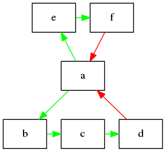
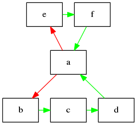

dataflow
=======

C++ DSL for easy graphical async programming.

concept
------

In dataflow, node represents some job.
Each node has directed edges which represent dependency flow.

```c++
  using namespace dataflow;
  // single worker.
  graph g(1);

  auto & a = g.add_node("a", [] () {});
  auto & b = g.add_node("b", [] () {});
  auto & c = g.add_node("c", [] () {});
  auto & d = g.add_node("d", [] () {});
  auto & e = g.add_node("e", [] () {});
  auto & f = g.add_node("f", [] () {});

  // connect nodes.
  a >> b >> c >> d >> a;

  // connect nodes.
  a >> e >> f >> a;

  g.fire(a);
  g.run();
  std::this_thread::sleep_for(std::chrono::seconds(20));
  g.stop();
```

Graph object manages nodes and connections.
Graphical representation of this network is fowllowing



At this time point, node a is in job queue.
When node is enqueued, the node sleeps until all incoming edges are locked.
If all incoming edges are locked, the node wake up and do associated job.
`graph::fire(node const & n)` enqueues `n` and lock it's all incomming edges.
`graph::run()` make workers wake up.



Now a worker finished a job associated to node `a`, and the node is dequeued.
When node is dequeued, all nodes connected with outgoing edge from the node are enqueued.
In this case, node `b` and `e` are enqueued, and edge `a -> e` and `a -> b` are locked.


Now node `b` and `e` are in queue.
If there are many workers, these node can be executed simultaneously.
In this example, there is one worker, and node `b` is executed.

This is how dataflow works.
Due to this calculation model, concurrent programming is really fun now!

Each node can have its own data.

```c++
  auto & a = g.add_node<int>("a", [] (int & a) {});
  auto & b = g.add_node<float>("b", [] (float & b) {});

  a >> b >> a;
```

Now node `a` and `b` has data `int` and `float`.
There data are passed to handler's first argument.

Node can also refer to other node's data.

```c++
  auto & a = g.add_node<int>("a", [] (int & a) {});
  auto & b = g.add_node<float>("b", [] (float & b, int & a) {});

  a >> b >> a;

  // data reference
  a << b;
```

This is a simple example how to share data.

```c++:
  auto & a = g.add_node<int>("a", [] (int & a) {});
  auto & b = g.add_node("b", [] (int & a) {});
  auto & c = g.add_node("c", [] (int & a) {});

  a >> b >> a;
  a >> c >> a;
  
  // data reference
  a << b;
  a << c;
```

This is a example of data race.
If there are multi workers, node `a` may be accessed and be written simultaneously.
Problem here is that there is no dependence between `b` and `c`. 

```c++:
  auto & a = g.add_node<int>("a", [] (int & a) {});
  auto & b = g.add_node("b", [] (int & a) {});
  auto & c = g.add_node("c", [] (int & a) {});

  a >> b >> c >> a;
  
  // data reference
  a << b;
  a << c;
```

The other solution is to use atomic variable.
```c++:
  auto & a = g.add_node<std::atomic_int>("a", [] (std::atomic_int & a) {});
  auto & b = g.add_node("b", [] (std::atomic_int & a) {});
  auto & c = g.add_node("c", [] (std::atomic_int & a) {});

  a >> b >> c >> a;
  
  // data reference
  a << b;
  a << c;
```

